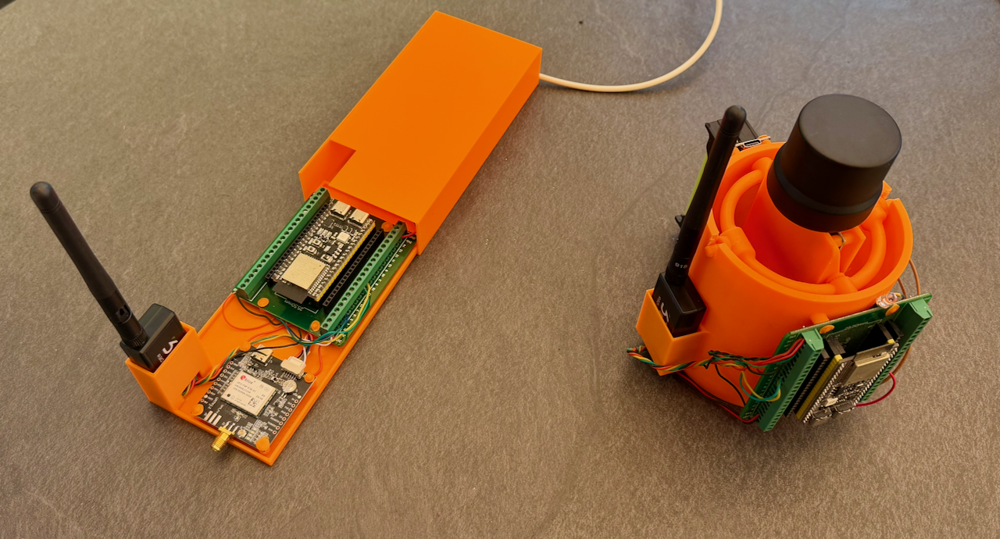
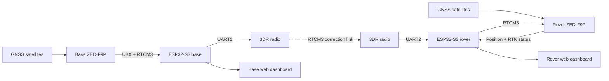
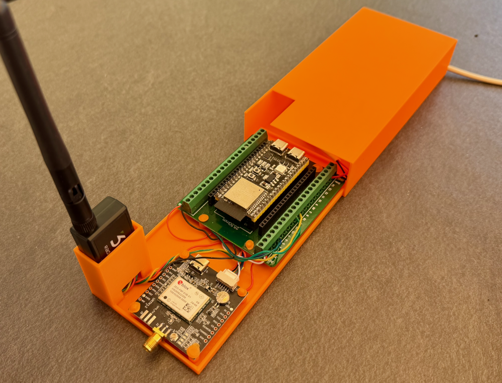
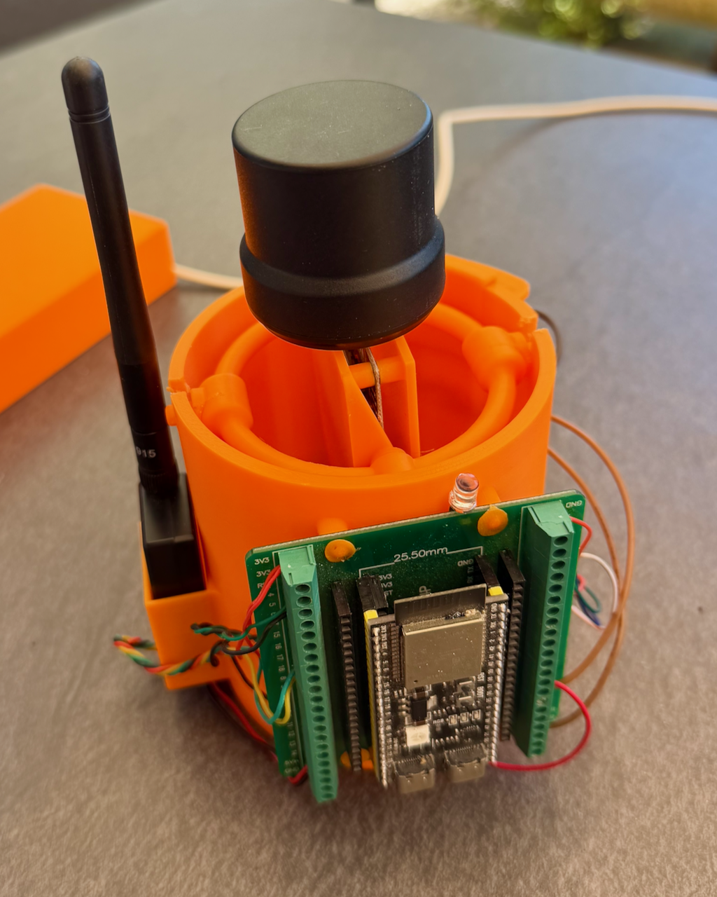
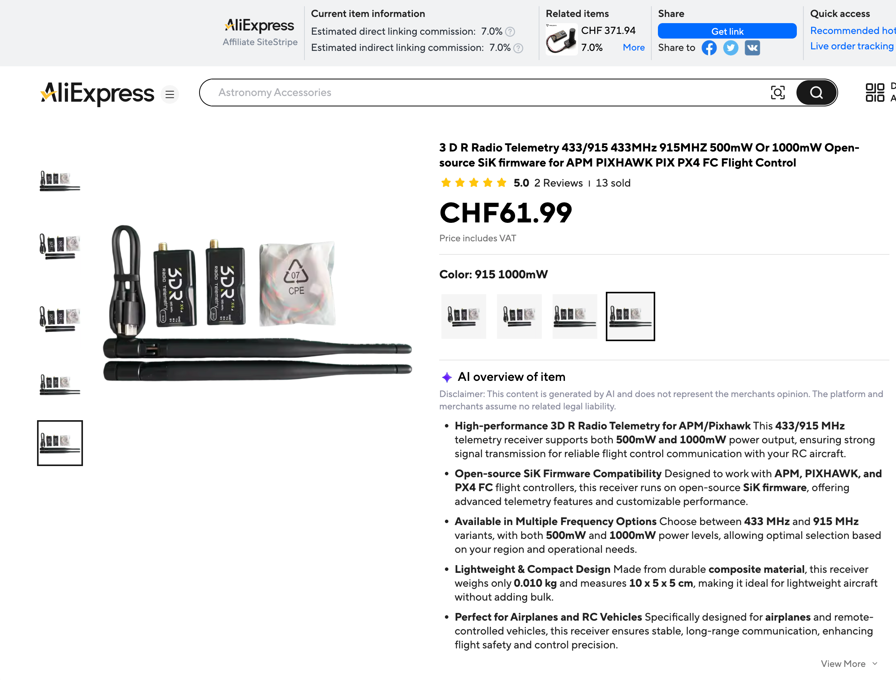

# ESP32-S3 GNSS RTK Base & Rover Tutorial



## Why I built this

I started this project because I wanted to understand **Real-Time Kinematic
(RTK) positioning** by building a complete system myself.

The idea came from watching my **Mammotion LUBA robotic mower** navigate the
garden with remarkable precision. I wanted to know what was happening behind
the scenes: How does a stationary reference receiver help a moving machine
determine its position within a few centimetres? What information is sent
between them? What is a survey-in, what are RTCM correction messages, and what
does an RTK fix actually mean?

Instead of treating RTK as a black box, I built my own base station and rover
around two ESP32-S3 boards, two u-blox ZED-F9P GNSS receivers, and a pair of 3DR
telemetry radios. This repository documents that learning journey and provides
a working starting point for anyone who would like to explore the same
technology.

> This is an independent educational project. It is not affiliated with or
> endorsed by Mammotion, and it does not communicate with or modify a LUBA
> mower.

## What the project does

The system consists of two independent ESP32-S3 devices:

- The **base station** determines and stores its stationary position, generates
  RTCM3 correction data, and sends it through a 3DR telemetry radio.
- The **rover** receives the corrections, forwards them to its ZED-F9P, and
  reports the resulting RTK position through a local web dashboard.



The correction link is deliberately simple: validated RTCM3 frames are relayed
as a byte stream. Wi-Fi is used for monitoring and OTA updates, not for the
critical base-to-rover correction path.

## The hardware

Each station uses:

- ESP32-S3-WROOM-1-N16R8 development board
- u-blox ZED-F9P GNSS receiver
- Multi-band GNSS antenna suitable for L1/L2 reception
- 3DR/SiK telemetry radio
- Appropriate power supply, wiring, and enclosure

The firmware also uses the ESP32-S3 board's RGB/status LED. The rover has an
additional blip LED on GPIO 47.

### Base station



The base remains stationary. After good satellite geometry has been stable for
15 seconds, it begins a survey-in. The default survey requires at least
300 seconds and targets 100 mm accuracy. When the survey completes, the base
saves its high-precision latitude, longitude, and ellipsoid altitude in the
ESP32's non-volatile Preferences storage.

On subsequent restarts—including restarts after an OTA update—the saved
position is reapplied to the ZED-F9P and the base returns directly to fixed
position/relay mode. A new survey is only required if the saved profile is
cleared, rejected, or the physical antenna position changes.

### Rover



The rover combines its own satellite observations with the RTCM3 corrections
received from the base. Its web interface shows position, fix type, satellite
information, correction activity, and a map. It can also record a track, create
waypoints, and export data as GPX or CSV.

## Wiring

Both ZED-F9P receivers communicate with their ESP32-S3 over UART1. The 3DR
radios use UART2.

| Connection | ESP32-S3 pin | Connects to |
|---|---:|---|
| GNSS RX | GPIO 4 | ZED-F9P TX1 |
| GNSS TX | GPIO 5 | ZED-F9P RX1 |
| Telemetry RX | GPIO 17 | 3DR radio TX |
| Telemetry TX | GPIO 18 | 3DR radio RX |
| RGB LED | GPIO 48 | On-board/status RGB LED |
| Rover blip LED | GPIO 47 | Rover correction indicator |

Remember that UART TX and RX lines cross: **TX connects to RX**, and all
devices must share a common ground.

> Check voltage levels and power requirements for your exact GNSS and telemetry
> hardware before connecting it. Do not assume every 3DR radio or breakout
> board is powered the same way.


## Software overview

The project uses PlatformIO with the Arduino framework. All third-party
application libraries are included locally under `lib/`; PlatformIO does not
download them through `lib_deps`.

The four build environments are:

| Environment | Purpose |
|---|---|
| `base` | Initial USB/serial upload to the base station |
| `base-ota` | Wireless firmware update of the base station |
| `rover` | Initial USB upload to the rover |
| `rover-ota` | Wireless firmware update of the rover |

The two main programs are:

- `src/baseStationTele.cpp`
- `src/roverStationTele.cpp`

## Before building

### 1. Install PlatformIO

Use either the PlatformIO extension for Visual Studio Code or PlatformIO Core.
Open this repository as the PlatformIO project.

### 2. Configure Wi-Fi and OTA credentials

The Wi-Fi SSID, Wi-Fi password, hostnames, and OTA passwords are currently
defined near the top of the two application source files:

- `src/baseStationTele.cpp`
- `src/roverStationTele.cpp`

Change these values for your network before publishing or sharing a compiled
firmware image.

> Do not commit real Wi-Fi or OTA credentials to a public repository. For a
> public fork, move secrets into an ignored local configuration header.

### 3. Configure the telemetry radios

Configure both 3DR/SiK radios to use compatible settings:

- Same network ID
- Same air data rate
- UART serial rate of **57,600 baud**
- Matching error-correction and framing settings

The base and rover firmware both expect the radio UART at 57,600 baud.

## Build and flash

### Initial base installation

Connect the base ESP32-S3 by USB:

```bash
pio run -e base -t upload
pio run -e base -t uploadfs
pio device monitor -b 115200
```

### Initial rover installation

Connect the rover ESP32-S3 by USB:

```bash
pio run -e rover -t upload
pio run -e rover -t uploadfs
pio device monitor -b 115200
```

The `uploadfs` step installs the local dashboards and their offline JavaScript
assets in LittleFS. Repeat it when files inside `data/` change. It is not
normally required for a firmware-only update.

### OTA firmware updates

Once the stations are running and connected to Wi-Fi:

```bash
pio run -e base-ota -t upload
pio run -e rover-ota -t upload
```

The configured mDNS addresses are:

- Base: `http://rtk-base-tele.local`
- Rover: `http://rtk-rover-tele.local`

A normal OTA update preserves the base station's saved survey position. RTCM
relay pauses during the update and reboot, then resumes after the stored fixed
position has been loaded.

## First operation

1. Place the base GNSS antenna in a stable location with a clear view of the
   sky. Do not move it after surveying.
2. Power the base and open its web dashboard.
3. Wait while it acquires satellites, checks GNSS quality, and completes its
   survey-in.
4. Confirm that the base reaches **RELAY** state and is transmitting RTCM
   frames.
5. Power the rover with its GNSS antenna outdoors and its telemetry radio
   connected.
6. Open the rover dashboard and confirm that RTCM data is arriving.
7. Allow the rover solution to progress from a normal GNSS fix to **RTK Float**
   and, under suitable conditions, **RTK Fixed**.

RTK performance depends heavily on antenna quality, sky visibility,
multipath, radio reliability, base-line distance, and the constellations visible
to both receivers.

## Base web dashboard

The base dashboard provides:

- Acquisition, survey-in, and relay state
- Survey duration and estimated accuracy
- Satellite and signal information
- Position quality, horizontal accuracy, and PDOP
- RTCM frame types, rate, byte count, and CRC diagnostics
- Adjustable survey accuracy target
- Manual re-survey control
- Session summary and CSV/JSON report downloads

Using **re-survey** intentionally clears the saved base profile. Do this whenever
the base antenna has been moved.

## Rover web dashboard

The rover dashboard provides:

- Current latitude, longitude, and altitude
- GNSS and RTK fix state
- Satellite and DOP information
- RTCM reception health
- Local map display
- Reference position and relative displacement
- Track recording and pause/resume
- Waypoints
- GPX and CSV export

Leaflet and Highcharts are stored locally in `data/vendor`, so the dashboards
do not depend on an internet connection after the filesystem has been uploaded.

## RTCM messages

The base configures the ZED-F9P to output these RTCM3 messages:

- 1005 — stationary RTK reference-station position
- 1074 — GPS MSM4 observations
- 1084 — GLONASS MSM4 observations
- 1094 — Galileo MSM4 observations
- 1124 — BeiDou MSM4 observations
- 1230 — GLONASS code-phase biases

The ESP32 validates each RTCM frame with CRC-24Q before relaying it. Frames
generated before the base has a valid fixed position are discarded.



## Project structure

```text
.
├── data/                       Web dashboards and offline assets
├── Doc/                        Photos, diagrams, and reference documents
├── lib/
│   ├── Adafruit_NeoPixel/
│   └── SparkFun_u-blox_GNSS_v3/
├── src/
│   ├── baseStationTele.cpp
│   └── roverStationTele.cpp
├── platformio.ini
└── README.md
```

## What I learned

Building the system made several RTK concepts much more concrete:

- A rover does not simply receive a more accurate coordinate from the base. It
  receives measurements and reference information that help its GNSS engine
  resolve positioning errors and carrier-phase ambiguities.
- The base position must remain consistent. Moving a surveyed antenna without
  re-surveying shifts the rover's results.
- “RTK Float” and “RTK Fixed” describe very different levels of ambiguity
  resolution and repeatability.
- Reliable correction delivery matters, but good antennas and a clean sky view
  matter just as much.
- Monitoring satellite geometry, correction age, message rates, and receiver
  state is invaluable when diagnosing a system.

Most importantly, the project turned the impressive precision of machines such
as the LUBA mower from something mysterious into a technology I could observe,
measure, and understand one message at a time.

## Notes and limitations

- This is a learning and experimentation platform, not a certified surveying
  instrument or safety system.
- Validate coordinates independently before using them for consequential work.
- Regulations for the radio frequency and transmit power of telemetry modules
  vary by country.
- GNSS antennas work best outdoors with a wide, unobstructed view of the sky.
- Keep the base antenna mechanically stable after its survey is complete.

## License

No project-specific license has been added yet. The libraries under `lib/` keep
their respective upstream licenses. Add an explicit project license before
redistributing or accepting contributions.
